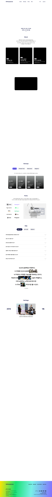

# 정주영 창업경진대회 랜딩 — 디자인 레퍼런스

원본: https://startup.asan-nanum.org (2026 행사 페이지, Next.js + CSS Modules, Figma 기반 제작)
소스: 브라우저에서 "다른 이름으로 저장"한 HTML과 `_files` 폴더



## 파일

| 경로 | 내용 |
|---|---|
| `index.html` | 정리된 마크업. 스크립트, 추적 코드, 브라우저 확장(DeepL, ChatGPT 사이드바)이 주입한 스타일은 제거. 브라우저로 바로 열면 레이아웃이 그대로 보임 |
| `css/site-global.css` | **전역 변수와 베이스 스타일 정리본.** 가장 먼저 볼 파일 |
| `css/components.css` | 섹션별 CSS Modules 정리본 (약 3,800줄) |
| `assets/*.css` | 원본 CSS. `index.html`이 실제로 불러오는 파일 |
| `assets/` 이미지·SVG | 로고, 파트너 로고, 팀 사진, Heritage 사진 등 |
| `assets/js/` | 원본 앱 번들(압축본). Hero 캔버스, 스크롤 연동 등 인터랙션 로직 참고용. 추적 스크립트(GTM, gtag)는 뺐음 |
| `preview-desktop.png` | 1440px 폭으로 렌더링한 정리본 전체 스크린샷 |

**저장본에서 빠지는 부분**
- Hero 캔버스와 스크롤 애니메이션: JS로 동작하므로 정적 HTML에서는 보이지 않음
- About 카드 3장 이미지와 오프닝 영상: 서버 절대경로(`/figma/...`, `blob:`)를 써서 저장되지 않음. 카드가 검게 보이는 이유

## 디자인 토큰 (`css/site-global.css`)

### 컬러
```css
--ink:    #141946;  /* 메인 네이비: 제목, 버튼 텍스트, 아이콘 */
--body:   #000;     /* 본문 */
--muted:  #707070;  /* 보조 텍스트 */
--line:   #d9d9d9;  /* 구분선 */
--paper:  #fff;     /* 배경 */
--chip:   #f2f2f2;  /* 탭, 칩 배경 */

--key-purple: #8278ff;   /* Global */
--key-mint:   #78f0e6;   /* Climate Tech */
--key-yellow: #ffe400;   /* Newcomer */
--key-green:  #19e173;   /* Beginner */
```
- 키 컬러 4개를 이은 **시그니처 그라디언트**(푸터 배경):
  `linear-gradient(96.25deg, #ffe400 0%, #19e173 29.8%, #78f0e6 59.8%, #826fff 100%)`
- 프로그램 탭과 카드는 `style="--tabColor:…"`, `--cardColor` 식으로 색을 넣는 방식. 컴포넌트 하나로 테마 4개를 처리함

### 타이포그래피
```css
--font-kr: "Pretendard Variable", "Pretendard", -apple-system, "Apple SD Gothic Neo", sans-serif;
--font-en: "Inter", var(--font-kr);
```
- `body { word-break: keep-all }`: 한글을 어절 단위로 줄바꿈
- 제목에 `text-wrap: balance`, 본문에 `text-wrap: pretty`
- 섹션 H2(About, Startups, Perks, FAQ, Heritage)는 영문 한 단어, 700 weight

| 요소 | 데스크톱 (1920 기준) | 모바일 (400 기준) |
|---|---|---|
| 섹션 H2 | 48–50 / 67–70, 700 | 30 / 50 |
| 프로그램 탭 | 36 / 50.4, 700 | — |
| 섹션 리드 | 28 / 44.8, 500 | 15–16 / 24–26 |
| FAQ 질문 | 30 / 40, 700, 자간 -1 | — |
| 인용문 | 56 / 80 | — |
| GNB CTA | 26, 800 | — |

### 스케일 시스템 (가장 재사용 가치가 큰 부분)
```css
:root {
  --desktop-s: .7px;
  --s: min(calc(100vw / 1920), var(--desktop-s));   /* 1920 아트보드 → 화면 비율, 최대 0.7 */
  --design-w: min(calc(100vw - 40 * var(--desktop-s)), calc(1600 * var(--desktop-s)));
}
@media (max-width: 1023.98px) {
  :root { --s: min(calc(100vw / 400), 1.25px); --design-w: 100%; }   /* 400 모바일 아트보드 */
}
```
모든 크기를 `calc(Figma px값 * var(--s))`로 씀. 디자이너가 넘긴 Figma 값을 그대로 옮겨 적으면 화면 크기에 맞게 비례 축소됨. 데스크톱에서는 0.7배가 상한이라 1920 화면에서는 시안의 70% 크기로 보임.

### 형태 · 모션
- 라운드: 카드 `16`, 썸네일 `8–12`, 탭 `60`, 버튼은 알약형(`100`/`999`), 단위는 모두 `--s`
- 카드 비율: About `500/640`, Startups `320/500`
- 이징: 감속 `cubic-bezier(.22,1,.36,1)`(플로팅 CTA 등장), 가감속 `cubic-bezier(.6,0,.4,1)`(인용문 사진 창)
- 상호작용 피드백: 대부분 `.18s` 배경·색 전환
- `prefers-reduced-motion` 대응 포함

## 페이지 구성 (위→아래)

1. **GNB**: `position: fixed` 투명 헤더. 스크롤하면 배경과 블러가 생김. 반투명 흰 알약 CTA `참가하기`
2. **Hero**: 풀스크린 `<canvas>` 비주얼. 하단 중앙에 일시·장소와 스크롤 화살표
3. **Floating CTA**: 스크롤하면 아래에서 올라오는 알약 바 (`참가하기` | 공유)
4. **About**: H2와 리드 문단 → 카드 3장. 하단 어두운 그라디언트 위에 태그 칩, 제목, 설명
5. **Opening Film**: sticky + 스크롤 진행률 `--p`에 따라 영상 박스가 커짐
6. **Startups**: 컬러 탭 4개 → 태그라인 → 세로형 팀 카드(사진 + 하단 블랙 그라디언트 + 👍 응원 수)
7. **Perks**: 왼쪽 파트너 로고 2열 그리드, 오른쪽 혜택 패널. 로고를 누르면 패널이 바뀜
8. **FAQ**: 카테고리 탭(선택된 탭은 네이비 채움) + 아코디언(구분선, 큰 셰브론)
9. **Quote**: 어록 문장 사이사이에 사진 "창"이 끼어드는 에디토리얼 레이아웃
10. **Heritage**: 스크롤 고정 타임라인. 왼쪽 연도, 가운데 사진 스택, 오른쪽 회차. 15단계 × `30vh`
11. **Footer**: 시그니처 그라디언트 배경, 계열 프로그램 로고, 재단 소개, SNS

## 다른 프로젝트에 적용할 때

- **바로 가져다 쓸 것**: `--s` 스케일 시스템, 컬러 변수 구조, `--cardColor` 테마 주입, 리셋과 타이포 규칙(`keep-all`, `balance`/`pretty`)
- **패턴만 참고할 것**: sticky 스크롤 섹션(Opening Film, Heritage), 사진 창이 섞인 인용문, 로고 → 패널 전환
- 로고, 사진, 영상, 카피, 파트너 로고는 아산나눔재단과 각 사 소유입니다. 구조와 스타일만 참고하고 에셋과 브랜딩은 교체하세요.
